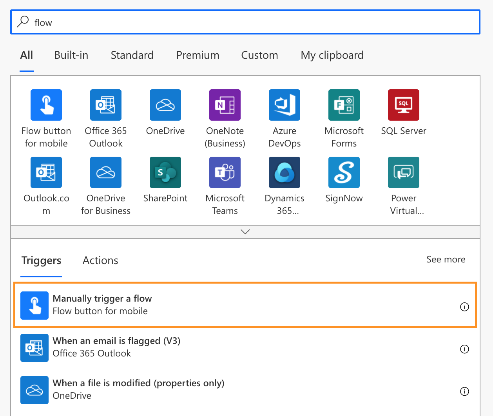
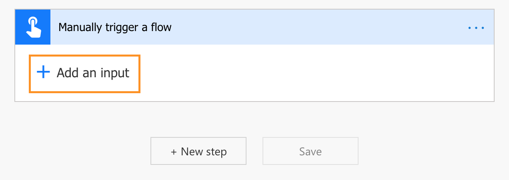
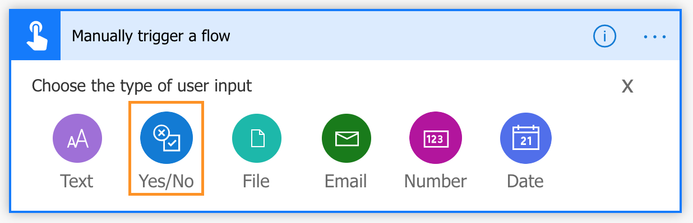
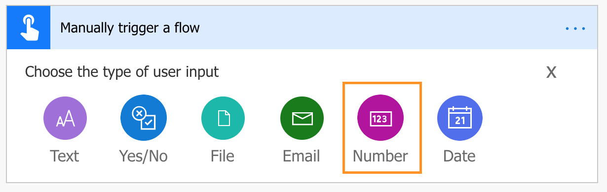
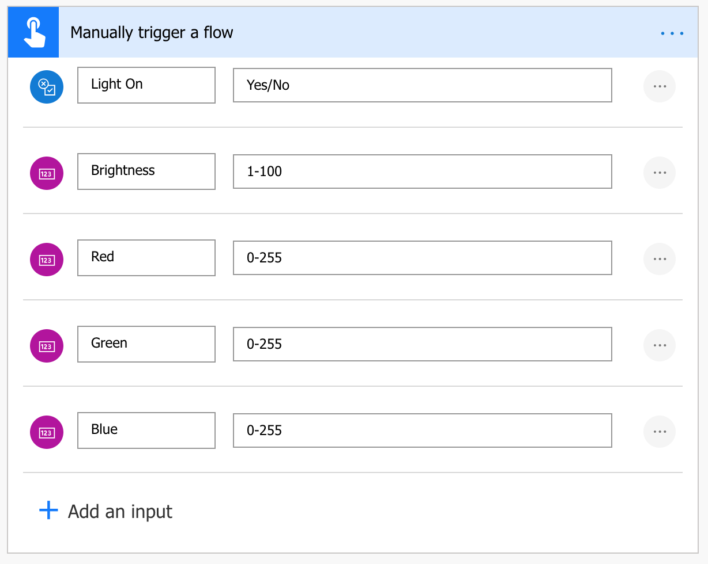
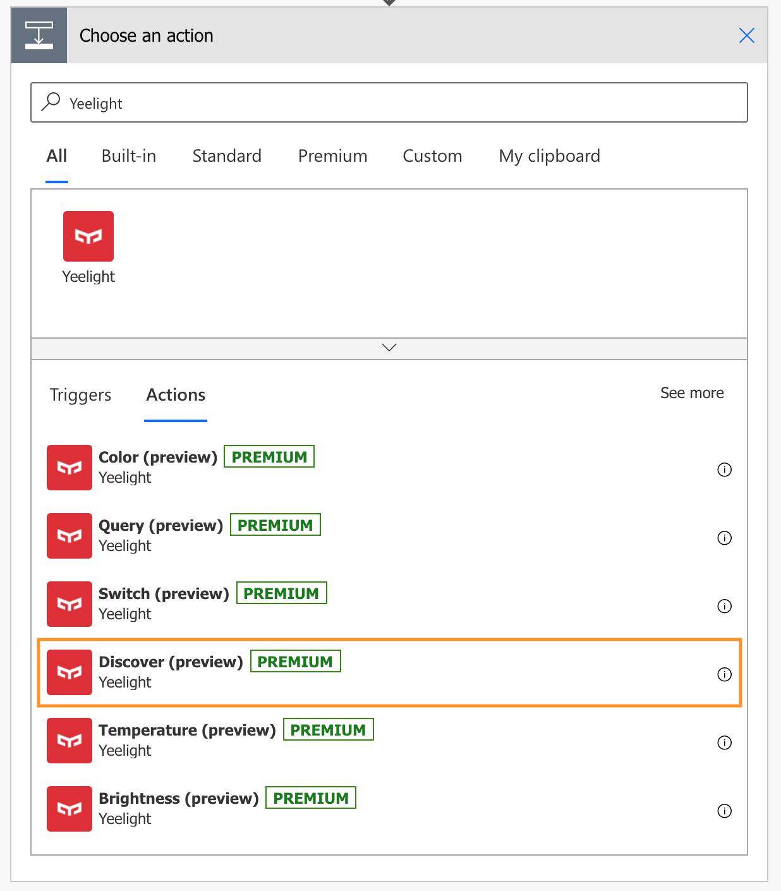
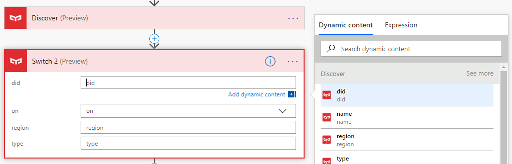
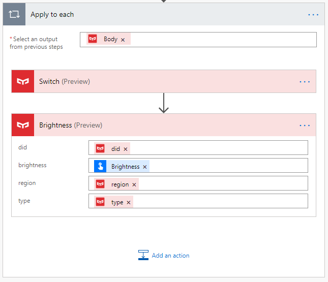
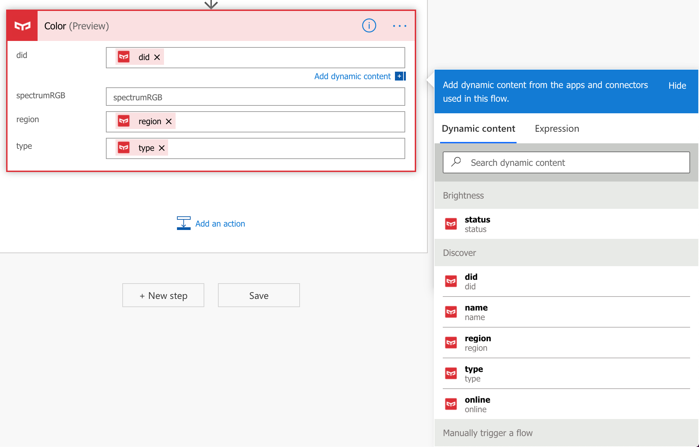
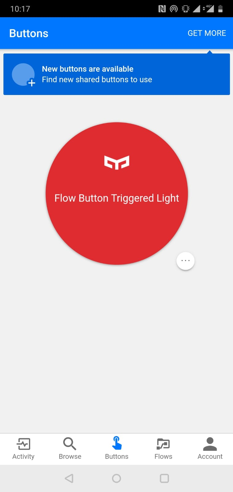

# Build IoT solutions with YeeLight and Microsoft Flow

This is a tutorial to build solution with IoT light which integrate with Microsoft Flow. You can keep them around your home and track data about your daily life.

This tutorial will 

Prerequisites:
1. Get a Mi Account in [Mi Home](https://account.xiaomi.com/)
2. Download Yeelight App  and login with Mi Account
3. Login [Microsoft Power Automate](https://asia.flow.microsoft.com/en-us/) with "onmicrosoft" account
4. Download Microsoft Power Automate App  and login with "onmicrosoft" account

# Create a new flow

In [Power Automate](https://asia.flow.microsoft.com/en-us/), goto "Create" and click ```Instant flow```.


A "Build an instant flow" box will show, click ```skip```.


# Choose the flow trigger

In search bar, type ```flow```, select the trigger ```Manually trigger a flow```.


Click ```Add an input```.


Choose ```Yes/No``` for Light On option.


Choose ```Number``` for Brightness, Red, Green, Blue options.


Add different input options as below:
- Light On: Yes/No
- Brightness: 1-100
- Red: 0-255
- Green: 0-255
- Blue: 0-255



# Add new action

1. Click ```+ New step```
2. Create an action
3. In search bar, search ```Yeelight```
4. Select ```Discover```



5. Repeat **1-4**
6. Select ```Switch```
7. Click ```did``` text field and select ```did``` in dynamic content



8. Fill in the rest like image below


9. Repeat **1-4**
10. Select ```Brightness```
11. Fill in the rest like image below



9. Repeat **1-4**
10. Select ```Color```
11. Fill in the rest like image below. The fomula is

```add(add(mul(triggerBody()['number_1'], 65536), mul(triggerBody()['number_2'], 256)), triggerBody()['number_3'])```



*RGB (Red, Green, Blue) are 8 bit each. The range for each individual colour is 0-255 (as 2^8 = 256 possibilities). The combination range is 256*256*256.*

# Test Microsoft Flow

Open Microsoft Flow App in mobile phone and test


