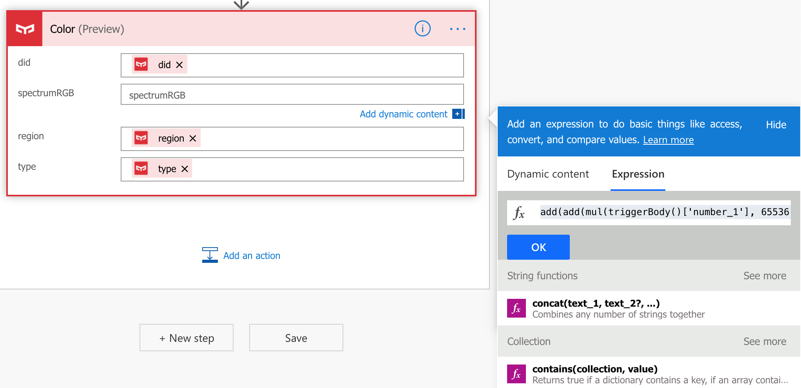
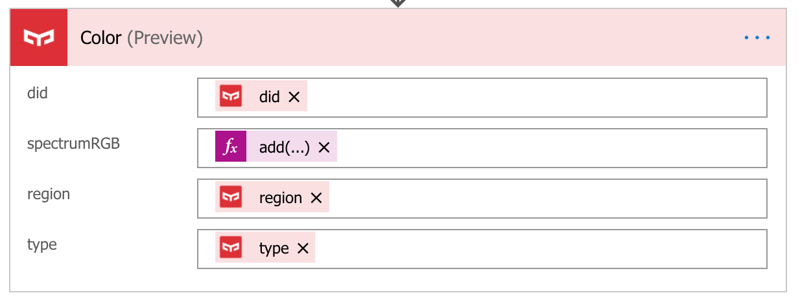

# Build IoT solutions with YeeLight and Microsoft Flow

This is a tutorial to build solution with IoT light which integrate with Microsoft Flow. You can keep them around your home and track data about your daily life.

Prerequisites:
1. [Mi Home Account](https://account.xiaomi.com/)
2. Registed YeeLight in Mi Home App
3. [Microsoft Flow Account](https://flow.microsoft.com/)
4. Microsoft Flow App (Android/iOS)

# Create a new Microsoft Flow

Sign in to [Microsoft Flow](https://flow.microsoft.com/) and create new flow in ```My flows```


Click ```Create from black```


# Add Microsoft Flow trigger

Search ```flow``` in search bar, then select ```Manually trigger a flow```


Add inputs as below (```Light On: Yes/No```, ```Brightness: number```, ```Red: number```, ```Green: number```, ```Blue: number```)


# Add Microsoft Flow action

1. Click ```+``` below the trigger
2. create an action
3. Search ```Yeelight```
4. Select ```Discover```


5. Repeat **1-4**
6. Select ```Switch```
7. Click ```did``` text field and select ```did``` in dynamic content


8. Fill in the rest like image below


9. Repeat **1-4**
10. Select ```Brightness```
11. Fill in the rest like image below


9. Repeat **1-4**
10. Select ```Color```
11. Fill in the rest like image below. The fomula is

```add(add(mul(triggerBody()['number_1'], 65536), mul(triggerBody()['number_2'], 256)), triggerBody()['number_3'])```


*RGB (Red, Green, Blue) are 8 bit each. The range for each individual colour is 0-255 (as 2^8 = 256 possibilities). The combination range is 256*256*256.*

# Test Microsoft Flow

Open Microsoft Flow App in mobile phone and test


