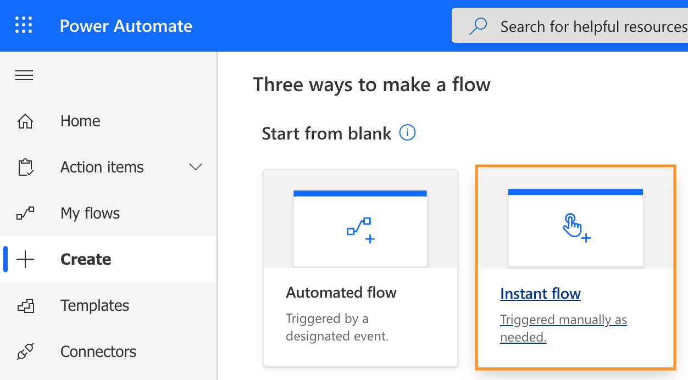
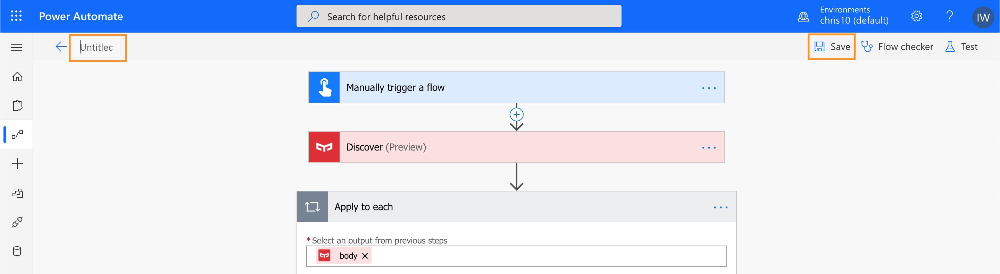

# Build IoT solutions with YeeLight and Microsoft Flow

This is a tutorial to build solution with IoT light which integrate with Microsoft Flow. You can keep them around your home and track data about your daily life.

This tutorial will 

## Prerequisites
1. Get a Mi Account in [Mi Home](https://account.xiaomi.com/)
2. Download Yeelight App  and login with Mi Account
3. Login [Microsoft Power Automate](https://asia.flow.microsoft.com/en-us/) with "onmicrosoft" account
4. Download Microsoft Power Automate App  and login with "onmicrosoft" account

## Create a new flow

1. In [Power Automate](https://asia.flow.microsoft.com/en-us/), goto "Create" and click ```Instant flow```



2. A "Build an instant flow" box will show, click ```skip```


## Choose the flow trigger

1. In search bar, type ```flow```, select the trigger ```Manually trigger a flow```


2. Click ```Add an input```


3. Choose ```Yes/No``` for Light On option


4. Choose ```Number``` for Brightness, Red, Green, Blue options


5. Add different input options as below:
- Light On: Yes/No
- Brightness: 1-100
- Red: 0-255
- Green: 0-255
- Blue: 0-255


## Add Yeelight Discover action
1. Click ```+ New step```
2. In search bar, search ```Yeelight```
3. Select ```Discover```


You need to sign in with your Mi Account.

## Add Yeelight Brightness action
1. Click ```+ New step```
2. In search bar, search ```Yeelight```
3. Select ```Brightness```


4. In ```Dynamic content```, add ```did``` under the field ```Discover```


5. The block will be added into "Apply to each", click on ```Brightness(Preview)``` expend the block and add ```Brightness``` from ```Dynamic content: Menually trigger a flow```, add ```region``` and ```type``` from ```Dynamic content: Discover```


## Add Yeelight Color action
1. Inside the "Apply to each", click 
2. In search bar, search ```Yeelight```
3. Select ```Color```
4. Fill in ```did```, ```region``` and ```type``` from ```Dynamic content: Discover``` as below:


5. In ```spectrumRGB```, click the tab ```Expression```
6. In ```fx``` field, copy and paste the formula<sup><a herf="#1">1</a></sup>:

```add(add(mul(triggerBody()['number_1'], 65536), mul(triggerBody()['number_2'], 256)), triggerBody()['number_3'])```


7. Click ```OK```


## Add Yeelight Switch action
1. Inside the "Apply to each", click 
2. In search bar, search ```Yeelight```
3. Select ```Switch```
4. Fill in ```did```, ```region```, ```type``` form ```Dynamic content: Discover```
5. In the field ```on```, click ```Enter custom value``` then select ```Light On``` from ```Dynamic content: Manually trigger a flow```


## Name and save the flow
1. Click ```Untitled``` on the left hand top to change your flow's name
2. Click ```Save``` on the right hand top to save all the changes



## Test Microsoft Flow

1. Open Microsoft Power Automate App  and login with "onmicrosoft" account

2. Click ```Buttons``` tab and you will see your flow button on the screen


3. Click the flow button and try to control your light


---

<sup>[1](#1)</sup> *RGB (Red, Green, Blue) are 8 bit each. The range for each individual colour is 0-255 (as 2^8 = 256 possibilities). The combination range is 256*256*256.*