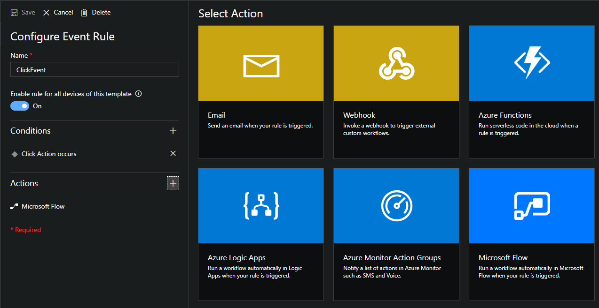

# Build IoT solutions with IoT Button

This is a tutorial to build solution with IoT button which integrate with excel online. You can keep them around your home and track data about your daily life like video below.

<a href="http://www.youtube.com/watch?feature=player_embedded&v=qKSqV44RZ3E
" target="_blank"></a>

# Key Concept
1. When you push IoT button, it will power up and connect to Internet via pre-configured Wi-Fi.
2. IoT button will send Device to Cloud Message to pre-configured Azure IoT Central.
3. Microsoft Flow will be triggered when received Cloud Message 
4. After D2C message is sent, IoT button will shutdown.


Part of tutorial based on [Docs for ReButton](https://seeedjp.github.io/ReButton/) and [IoT Central Documentation](https://docs.microsoft.com/en-us/azure/iot-central/)

# Step 1 - Getting access to IoT button

Use AP Mode (Access Point Mode) to configure IoT button. **To avoid battery drain, IoT button will automatically shutdown in 10 minutes, at AP mode.** So that we recommend you to setup IoT Hub or IoT Central, first.

1. **Hold button until RGB LED turns into White.**
RGB LED will start with Blue, Yellow, Cyan, then White. This will take about 10 seconds.

2. **Release button and confirm IoT button is in AP mode.**
When IoT button successfully boots into AP Mode, RGB LED will blink in White.

3. **Connect to AP.**
Look for Wi-Fi Access Point ```AZB-xxxxxxxxxxxx``` and connect to it from your PC.
(```xxxxxxxxxxxx``` is MAC address of your IoT button Wi-Fi.)


Use a Web Browser to access IoT button - Home at ```http://192.168.0.1.```


# Step 2 - Wi-Fi Configuration

Configure Wi-Fi settings to connect to Internet.

1. Click ```Wi-Fi``` at IoT button - Home.


2. Select your Wi-Fi Access Point from ```Wi-Fi SSID``` list.
If you do not see your Access Point, refresh browser.
3. Enter ```Wi-Fi Passphrase``` for your Wi-Fi AP.
4. In case you would like to use specific Internet ```Time Server```, enter FQDN to Time Server.
Default Internet Time Server is pool.ntp.org -> cn.pool.ntp.org -> europe.pool.ntp.org -> asia.pool.ntp.org -> oceania.pool.ntp.org .

5. Click ```Save```.

# Step 3 - Create IoT Central

1. Sign in [Azure Portal](https://portal.azure.com/)
2. Click ```Create a resource``` and search ```IoT Central Application```


3. Create ```IoT Central Application```


4. Fill in ```resource name```, ```Application URL```, and set template as ```Custom Application```. Then click ```create```.


5. Go to the resource, mark down your ```IoT Application URL```


# Step 4 - Create IoT Central device template

1. Access ```IoT Application URL```
2. Navigate to the Device Templates page.
3. To create a template, start by selecting +New.
4. Select Custom, enter a name, and click Create to build your own template from scratch.

#### Measurements
Measurements are the data that comes from your device. You can add multiple measurements to your device template to match the capabilities of your device. 

+ **Telemetry** measurements are the numerical data points that your device collects over time. They're represented as a continuous stream. An example is temperature.
+ **Event** measurements are point-in-time data that represents something of significance on the device. A severity level represents the importance of an event. An example is a fan motor error.
+ **State** measurements represent the state of the device or its components over a period of time. For example, a fan mode can be defined as having Operating and Stopped as the two possible states.

# Step 5 - IoT Button Measurements Configuration

In order to send Device to Cloud (D2C) message to Azure IoT Central, save device provisioning information in IoT button.

| Type|Field Name| Values|
|-|-| -|
|Telemetry|batteryVoltage|Battery Voltage Level (Volt)|
|State|actionNum|1:Single click, 2:Double click, 3:Triple click, 10:Long press, 11:Super long press|
|Event|message||

#### Telemetry

To add a new telemetry measurement, select + New Measurement, choose Telemetry as the measurement type, and enter the details on the form.


#### State

To add a new state measurement, select the + New Measurement button and select State as the measurement type. Enter the details on the Create State form.


#### Event

To add a new event measurement, select + New Measurement and select Event as the measurement type. Enter the details on the Create Event form.


1. Create a device in Azure IoT Central.

2. Click ```Connect``` on Top Right corner of Azure IoT Central page.


3. Copy 3 values.
```Scope ID```
```Device ID```
```Primary Key```


4. Browse to IoT button - Home page then click ```Azure IoT Central```.
5. Enter ```Scope ID```, ```Device ID```, ```SAS Key``` from Azure IoT Central.
6. Click ```Save```.


# Step 6 - Power Off

Exit AP Mode and power off IoT button.

Click ```Shutdown``` button.

# Step 7 - Create Excel table

1. Go to [OneDrive](https://onedrive.live.com/) and create Excel workbook


2. Follow the column name below

|Device|Action|Time|
|-|-| -|

3. Click ```Format as Table```


# Step 8 - Create event-based rule

1. Access ```IoT Application URL```
2. To add a new event-based rule to your application, in the left navigation menu, select Device Templates.


3. To customize your device template, select the template you created in the previous tutorial.
4. To add a event-based rule in the Rules view, select Rules, select + New Rule, and then select Event:


5. To define your rule, use the information in the following image:


6. Click ```Save```

# Step 8 - Add Microsoft Flow as Action

1. Add Microsoft Flow Action in saved event rule



2. Create Flow from blank in Microsoft Flow page


3. Search ```IoT Central``` and click ```When a rule is fired```


4. Click the dropdown and select the ```Application``` and ```Rule```


5. Search ```Excel``` and add an action ```Add a row in a table```


6. Follow the information in below image and complete the Flow 

