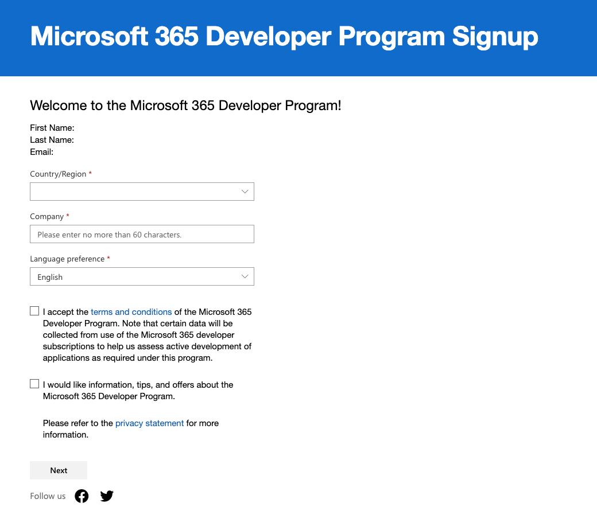
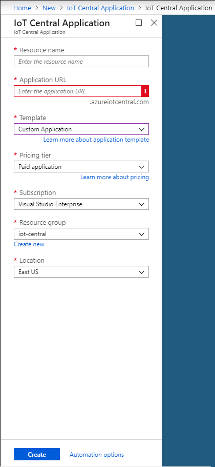

# IoT Button

In this tutorial, we will try to connect ReButton with Azure IoT Central and integrate with Power Automate to provide different IoT solutions.

# About ReButton
Build IoT solutions with IoT Button!

Seeed [ReButton](https://seeedjp.github.io/ReButton/) is a developer device for simple trigger actions, supporting multiple clicks and long press.
In addition, you can connect Seeed Grove sensors to add more data points.

1. When you push ReButton, it will power up and connect to Internet via pre-configured Wi-Fi.
2. ReButton will receive Device Twin changes from pre-configured Azure IoT Central or Azure IoT Hub.
3. ReButton will send Device to Cloud Message to pre-configured Azure IoT Central or Azure IoT Hub.
4. After D2C message is sent, ReButton will shutdown.


Note: Part of tutorial based on [Docs for ReButton](https://seeedjp.github.io/ReButton/) and [IoT Central Documentation](https://docs.microsoft.com/en-us/azure/iot-central/) with the update of Azure IoT Central V3.

# Prerequisites
## Join the Microsoft 365 Developer Program
1. Goto [Microsoft 365 Dev Center](https://developer.microsoft.com/en-us/microsoft-365/dev-program) and click ```Join Now```


2. Login with your personal Microsoft account, you could create one if you do not have Microsoft account.


2.1 If you see this message, your account may missing some information, mostly will be the full name of the account.


2.2 Click the top-right corner to view your account information and click ```Add your name```.


2.3 Fill in your first name and last name, then click ```Save```, sign out and login agin at [Microsoft 365 Dev Center](https://developer.microsoft.com/en-us/microsoft-365/dev-program) to continue.


3. Follow the instructions and complete all the fields needed.

 

4. Click ```SET UP E5 SUBSCRIPTION```


5. Fill in the information, for username will suggest "admin", for domain please choose a domain name which is not yet be chosen by anyone. You will create an account ```admin@yourdomain.onmicrosoft.com```, we will use this account for following labs and tutorials, so keep your password and account in safe. Click ```Continue``` and add your phone number for verification.


6. You have successfully created your Microsoft 365 developer account with E5 subscription, to know more about E5 subscription please visit [this link](https://www.microsoft.com/en-us/microsoft-365/enterprise/e5).


### Reference
- [Welcome to the Microsoft 365 Developer Program](https://docs.microsoft.com/en-us/office/developer-program/microsoft-365-developer-program)

- [Set up a Microsoft 365 developer subscription](https://docs.microsoft.com/en-us/office/developer-program/microsoft-365-developer-program-get-started)

---

## Redeem the Azure Pass
After created the ```onmicrosoft.com``` account, we need an active subscription for creating the IoT Central in Azure.

1. Visit [Azure Pass](https://www.microsoftazurepass.com/) website, click ```Start``` and login with your ```onmicrosoft.com``` account.

2. Confirm your email address is correct, then click ```Confirm``` and enter your Azure Pass promotion code, click ```Claim Promo Code```.


3. Follow the instruction and fill in the information, you will be redirected to the [Azure Portal](https://portal.azure.com/).

# Getting Started
## Step 1 - Create IoT Central

1. Sign in [Azure Portal](https://portal.azure.com/)
2. Click ```Create a resource``` and search ```IoT Central Application```


3. Create ```IoT Central Application```


4. Fill in ```resource name```, ```Application URL```, and set template as ```Custom Application```. Pricing plan can choose either ```Standard 1``` or ```Standard 2```. Then click ```create```.



## Step 2 - Create ReButton Template

1. Access ```IoT Application URL``` and login with your Microsoft Account.
2. Navigate to the Device Templates page.
3. Create the ReButton device temmplate by clicking the ```+ New``` button.
4. Scroll down and find "ReButton", select it and click ```Next: Review```.
5. Confirm the information and click ```Create```.


## Step 3 - Create Device Template View

1. In "ReButton" template, click "Overview" under "Views".
2. In "Edit view", you can delete the previous blocks on left hand side. Then  


## Step 5 - IoT Button Measurements Configuration

In order to send Device to Cloud (D2C) message to Azure IoT Central, save device provisioning information in IoT button.

| Type|Field Name| Values|
|-|-| -|
|Telemetry|batteryVoltage|Battery Voltage Level (Volt)|
|State|actionNum|1:Single click, 2:Double click, 3:Triple click, 10:Long press, 11:Super long press|
|Event|message||


1. Create a device in Azure IoT Central.

2. Click ```Connect``` on Top Right corner of Azure IoT Central page.


3. Copy 3 values.
```Scope ID```
```Device ID```
```Primary Key```


4. Browse to IoT button - Home page then click ```Azure IoT Central```.
5. Enter ```Scope ID```, ```Device ID```, ```SAS Key``` from Azure IoT Central.
6. Click ```Save```.


5. Go to the resource, mark down your ```IoT Central Application URL```. Click the link and access your IoT Central.


## Step 1 - Getting access to IoT button

Use AP Mode (Access Point Mode) to configure IoT button. **To avoid battery drain, IoT button will automatically shutdown in 10 minutes, at AP mode.** So that we recommend you to setup IoT Hub or IoT Central, first.

1. **Hold button until RGB LED turns into White.**
RGB LED will start with Blue, Yellow, Cyan, then White. This will take about 10 seconds.

2. **Release button and confirm IoT button is in AP mode.**
When IoT button successfully boots into AP Mode, RGB LED will blink in White.

3. **Connect to AP.**
Look for Wi-Fi Access Point ```AZB-xxxxxxxxxxxx``` and connect to it from your PC.
(```xxxxxxxxxxxx``` is MAC address of your IoT button Wi-Fi.)


Use a Web Browser to access IoT button - Home at ```http://192.168.0.1.```


## Step 2 - Wi-Fi Configuration

Configure Wi-Fi settings to connect to Internet.

1. Click ```Wi-Fi``` at IoT button - Home.


2. Select your Wi-Fi Access Point from ```Wi-Fi SSID``` list.
If you do not see your Access Point, refresh browser.
3. Enter ```Wi-Fi Passphrase``` for your Wi-Fi AP.
4. In case you would like to use specific Internet ```Time Server```, enter FQDN to Time Server.
Default Internet Time Server is pool.ntp.org -> cn.pool.ntp.org -> europe.pool.ntp.org -> asia.pool.ntp.org -> oceania.pool.ntp.org .

5. Click ```Save```.


## Step 6 - Power Off

Exit AP Mode and power off IoT button.

Click ```Shutdown``` button.

## Step 7 - Create Excel table

1. Go to [OneDrive](https://onedrive.live.com/) and create Excel workbook


2. Follow the column name below

|Device|Action|Time|
|-|-| -|

3. Click ```Format as Table```


## Step 8 - Create event-based rule

1. Access ```IoT Application URL```
2. To add a new event-based rule to your application, in the left navigation menu, select Device Templates.


3. To customize your device template, select the template you created in the previous tutorial.
4. To add a event-based rule in the Rules view, select Rules, select + New Rule, and then select Event:


5. To define your rule, use the information in the following image:


6. Click ```Save```

## Step 8 - Add Microsoft Flow as Action

1. Add Microsoft Flow Action in saved event rule


2. Create Flow from blank in Microsoft Flow page


3. Search ```IoT Central``` and click ```When a rule is fired```


4. Click the dropdown and select the ```Application``` and ```Rule```


5. Search ```Excel``` and add an action ```Add a row in a table```


6. Follow the information in below image and complete the Flow 

